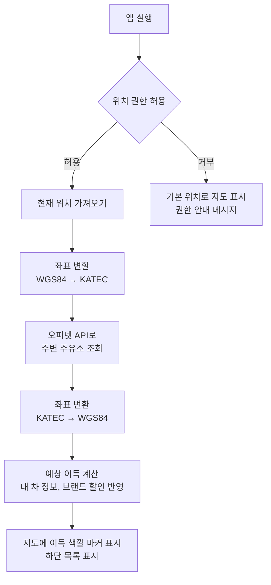

# FindCheapGas

내 차 연비와 할인 카드를 반영하고 주유소까지 가는 비용까지 더해서, **내 조건에 따른 예상 총비용이 가장 낮은 주유소**를 찾아주는 안드로이드 앱입니다.

표시 가격이 가장 싼 주유소가 항상 이득인 것은 아닙니다. 멀리 있는 주유소는 가는 데 기름을 더 쓰고, 카드나 멤버십 할인을 받으면 표시 가격이 더 비싼 주유소가 실제로는 더 쌀 수 있습니다.
이 앱은 주변 주유소 가격에 내 차 정보와 할인 정보를 더해서 "여기서 넣으면 얼마나 이득일지"를 추정하고, 지도와 목록에 그 결과를 보여줍니다.

## 목차

1. [이 앱이 계산하는 것](#이-앱이-계산하는-것)
2. [예상 이득 계산 방식](#예상-이득-계산-방식)
3. [주요 기능](#주요-기능)
4. [화면 구성](#화면-구성)
5. [동작 방식](#동작-방식)
6. [기술 스택](#기술-스택)
7. [외부 API](#외부-api)
8. [API 호출 제한 대응](#api-호출-제한-대응)
9. [프로젝트 구조](#프로젝트-구조)
10. [실행 방법](#실행-방법)
11. [개발 진행 상황](#개발-진행-상황)
12. [데이터 출처](#데이터-출처)

## 이 앱이 계산하는 것

유가 정보는 오피넷(한국석유공사)에서 가져옵니다. 이 앱은 그 가격에 사용자 조건을 더해서 아래 값을 계산하고, 이 값을 기준으로 주유소 순위를 매깁니다.

| 계산 항목 | 내용 |
|---|---|
| 할인 반영 기름값 | 브랜드별 리터당 할인을 적용하되, 1회 할인 한도를 넘지 않게 계산합니다. |
| 주유소까지 가는 연료비 | 주유소까지의 도로 거리를 추정하고, 내 차 연비로 그 거리를 가는 데 드는 연료비를 계산합니다. |
| 예상 총비용 | 할인 반영 기름값과 주유소까지 가는 연료비를 더한 값입니다. 목록의 기본 정렬 기준입니다. |
| 예상 이득 | 가장 가까운 주유소에서 넣을 때보다 예상 총비용이 얼마나 적은지 보여줍니다. 지도 마커 색도 이 값으로 정합니다. |

같은 계산을 현재 위치뿐 아니라 집과 회사 근처에도 적용해서 어디서 넣는 게 유리한지 비교하고, 홈 화면 위젯으로도 보여줍니다.

## 예상 이득 계산 방식

가장 가까운 주유소를 기준으로 삼고, 각 주유소에서 넣었을 때 예상 총비용이 기준보다 얼마나 적은지 계산합니다.

```
할인액      = min(리터당 할인 × 주유량, 1회 할인 한도)
기름값      = 표시 가격 × 주유량 − 할인액
이동 거리   = 직선거리 × 1.4   (도로 거리 추정, 편도)
이동 비용   = 이동 거리 ÷ 연비 × 표시 가격
예상 총비용 = 기름값 + 이동 비용
예상 이득   = 기준 주유소 예상 총비용 − 이 주유소 예상 총비용
```

예시 1 (연비 12km/L, 주유량 40L, 할인 없음)

| | 가장 가까운 주유소 | 3km 떨어진 주유소 |
|---|---|---|
| 표시 가격 | 1,700원 (0.5km) | 1,640원 (3km) |
| 기름값 | 68,000원 | 65,600원 |
| 이동 비용 | 약 99원 | 약 574원 |
| 예상 총비용 | 68,099원 | 66,174원 |
| 예상 이득 | 기준 | **약 1,925원 이득** |

예시 2 (할인 한도)

리터당 100원 할인, 1회 할인 한도 3,000원인 카드로 40L를 넣으면 할인액은 4,000원이 아니라 3,000원입니다. 한도를 입력하지 않으면 한도 없이 계산합니다.

### 계산의 가정과 한계

- **편도 거리**: 조회 위치에서 주유소까지 가는 거리만 계산합니다. 주유한 뒤에는 원래 가려던 곳으로 이어서 간다고 보고, 돌아오는 거리는 넣지 않습니다.
- **조회 위치**: 기본은 현재 위치이고, 장소나 주유소 이름을 검색해서 고르면 그 위치가 조회 위치가 됩니다. 지도를 옮긴 뒤 "이 지역에서 다시 검색"을 누르면 지도 중심이 조회 위치가 되고, "역삼1동 기준"처럼 동 이름으로 표시합니다(이름을 얻지 못하면 "지도 중심 기준"). 거리, 이동 비용, 기준 주유소, 예상 이득은 모두 "조회 위치에서 출발한다면"으로 계산합니다. 검색한 위치로 조회 중이면 지도 위에 "강남역 기준" 같은 표시가 나오고, 목록 위쪽과 상세 화면에도 "강남역에서 0.7km"처럼 조회 위치 이름을 보여줍니다.
- **도로 거리 계수 1.4**: 실제 도로는 직선이 아니어서 도로 거리는 직선거리보다 깁니다. 미국 전역 66,011곳에서 가장 가까운 병원까지의 운전 거리와 직선거리를 비교한 연구에서 그 비율(우회 계수)이 1.417로 나타났고, 연구진은 직선거리에 약 1.4를 곱하면 운전 거리의 적절한 대체값이 된다고 결론지었습니다 [1]. 이 앱은 이 값을 따릅니다.
  - 미국 자료이므로 국내 도로에서는 차이가 있을 수 있습니다.
  - 짧은 거리일수록 우회 비율이 더 커지는 경향이 있어 [2], 5km 이내 거리에서는 실제 거리가 더 길 수 있습니다.
  - 강, 다리, 일방통행, 고속도로 진출입 때문에 실제 거리와 크게 다를 수 있고, 이 경우 순위가 바뀔 수 있습니다.
  - 주유소마다 길찾기 API를 부르면 호출이 너무 많아져서 이 방식으로 추정합니다. 화면에는 추정치임을 표시합니다.
  - 2026년 11월 4일에 강남역에서 반경 5km 안의 실제 주유소 19곳까지 카카오모빌리티 자동차 길찾기 도로 거리를 직선거리와 비교했습니다. 합계 기준 비율(도로 거리 합 ÷ 직선거리 합)은 1.455, 중앙값은 1.419입니다.
    - 구간별 합계 기준 비율은 0\~1km 1.85(5곳), 1\~3km 1.52(7곳), 3\~5km 1.36(7곳)으로, 가까울수록 우회 비율이 컸습니다.
    - 전체로는 1.4와 비슷해서 계수 1.4를 그대로 씁니다. README 예시 1의 3km 주유소 이동 비용은 1.4일 때 약 574원, 1.455일 때 약 597원으로 차이가 작습니다. 다만 1km 이내 주유소는 실제 이동 거리가 추정보다 길 수 있습니다.
    - 출발점이 한 곳이고 측정 시점의 경로 하나만 반영한 결과입니다. 측정 결과는 [docs/road-distance-check.csv](docs/road-distance-check.csv)에 있습니다.
- **할인 조건**: 리터당 할인과 1회 할인 한도만 반영합니다. 전월 실적, 월 누적 한도 같은 카드사 조건은 반영하지 않습니다.
  - 1회 할인 한도를 비워 두면 한도 없이 계산하고, 설정 화면과 계산 내역에 "한도 미적용"이라고 표시합니다. 비워 둔 것을 무제한 할인으로 오해하지 않게 하기 위해서입니다.
  - 한도를 비워 둔 상태에서 할인액이 5,000원 이상이면, 계산 내역에 "한도가 있다면 실제 할인은 이보다 적을 수 있습니다"라고 안내합니다.
- **기준 주유소**: 숨긴 브랜드와 브랜드 빠른 필터를 먼저 적용하고, 화면에 보이는 주유소 중 가장 가까운 곳을 기준으로 삼습니다. 기준 주유소의 브랜드에 할인이 있으면 기준에도 할인을 적용합니다.
- **기본값**: 내 차 정보를 입력하지 않으면 연비 12km/L, 주유량 40L로 계산합니다.
- **계산 기준 표시**: 어떤 조건으로 계산했는지 항상 화면에 보여줍니다.
  - 기본값을 쓰는 경우: `연비 12km/L · 40L 기준 (기본값)`
  - 직접 입력한 경우: `내 차 기준 · 연비 15km/L · 50L`
  - 목록 위쪽, 상세 화면의 계산 내역, 홈 화면 위젯에 표시하고, 목록 위쪽의 문구를 누르면 내 차 정보 화면이 열립니다.

참고 자료

1. Boscoe, F. P., Henry, K. A., & Zdeb, M. S. (2012). A Nationwide Comparison of Driving Distance Versus Straight-Line Distance to Hospitals. *The Professional Geographer*, 64(2). [원문](https://pmc.ncbi.nlm.nih.gov/articles/PMC3835347)
2. Giacomin, D. J., & Levinson, D. M. (2015). Road network circuity in metropolitan areas. *Environment and Planning B*, 42(6), 1040–1053. [요약](https://experts.umn.edu/en/publications/road-network-circuity-in-metropolitan-areas/)

## 주요 기능

기능을 4단계로 나누고 순서대로 개발합니다. 앱의 차별점인 예상 이득 계산은 2단계에 두어 먼저 완성합니다.

### 1단계 - 기본 기능

| 기능 | 설명 |
|---|---|
| 현재 위치 지도 | 앱을 실행하면 위치 권한을 요청하고, 현재 위치를 중심으로 지도를 띄웁니다. 현재 위치는 점으로 표시합니다. |
| 주변 주유소 표시 | 주변 주유소를 가격과 함께 마커로 표시하고, 아래 목록에 보여줍니다. |
| 유종 선택 | 휘발유, 경유, 고급휘발유, LPG 중에서 선택합니다. |
| 반경 선택 | 1km, 3km, 5km 중에서 선택합니다. |
| 정렬 | 목록을 가격순 또는 거리순으로 정렬합니다. |
| 상세 정보 | 주유소를 누르면 주소, 전화번호, 유종별 가격, 부가시설(셀프, 세차장, 편의점 등)을 보여줍니다. |

### 2단계 - 차별화 기능

| 기능 | 설명 |
|---|---|
| 내 차 정보 | 처음 실행할 때 연비와 평소 주유량을 입력받습니다. 건너뛸 수 있고, 설정에서 바꿀 수 있습니다. 건너뛰면 기본값으로 계산하고, 기본값으로 계산 중이라는 것을 화면에 표시합니다. |
| 예상 이득 계산 | 할인과 이동 비용을 반영해서 주유소마다 예상 이득을 계산합니다. 목록에 "약 OO원 이득"을 표시하고, 기본 정렬을 예상 이득순으로 합니다. 목록 위쪽에 계산 기준(연비, 주유량)을 항상 표시합니다. |
| 이득 색깔 마커 | 마커 색을 예상 이득 기준으로 칠합니다. 1,000원 이상 이득은 초록, 1,000원 이내 차이는 노랑, 1,000원 이상 손해는 빨강입니다. |
| 내 브랜드 설정 | 브랜드마다 리터당 할인, 1회 할인 한도, 선호, 숨기기를 정합니다. 할인은 한도 안에서 계산에 반영하고, 숨긴 브랜드는 표시하지 않습니다. 선호 브랜드는 예상 이득순 정렬에서만 정렬용 점수에 500원을 더해 위로 올립니다. 화면에 보이는 이득 금액과 "이득 1위"는 실제 예상 이득 그대로입니다. 한도를 비워 두면 "한도 미적용"으로 표시합니다. 선호와 숨기기는 함께 켤 수 없습니다. |
| 브랜드 빠른 필터 | 지도 위 필터에서 원하는 브랜드만 보거나, 할인 브랜드만 / 선호 브랜드만 볼 수 있습니다. 여러 개를 고르면 하나라도 맞는 주유소를 보여주고, 고른 값은 앱을 다시 켜도 유지합니다. 숨긴 브랜드는 필터 메뉴에도 나오지 않습니다. |

### 3단계 - 주요 기능

| 기능 | 설명 |
|---|---|
| 장소 검색 | 장소(예: 강남역, 해운대구)를 검색하면 지도를 해당 위치로 옮기고 주변 주유소를 보여줍니다. |
| 주유소 이름 검색 | 주유소 이름으로 검색합니다. |
| 즐겨찾기 | 자주 가는 주유소를 최대 20곳까지 저장하고 즐겨찾기 탭에 모아서 봅니다. 지금 고른 유종의 가격, 조회 위치에서의 거리, 예상 이득을 함께 보여줍니다. 조회 위치에서 5km 밖인 주유소는 예상 이득을 계산하지 않습니다. 가격은 저장하지 않고 볼 때마다 가져옵니다. |
| 길찾기 | 버튼을 누르면 카카오맵 또는 티맵 앱을 열고 해당 주유소를 목적지로 자동 입력합니다. 실제 길안내는 각 앱이 담당합니다. 앱이 설치되어 있지 않으면 플레이스토어 설치 페이지로 이동합니다. |
| 이 지역에서 다시 검색 | 지도를 옮긴 뒤 버튼을 누르면 지도 중심을 기준으로 다시 검색합니다. |

### 4단계 - 추가 기능

| 기능 | 설명 |
|---|---|
| 집·회사 기준 비교 | 집과 회사 위치를 저장해 두고, 지금 위치 / 집 근처 / 회사 근처 중 어디서 넣는 게 가장 이득인지 한 화면에서 비교합니다. |
| 홈 화면 위젯 | 앱을 열지 않아도 홈 화면에서 이득 1위 주유소와 가격, 이득 금액을 보여줍니다. 집이나 회사 위치 기준으로 보여주므로 백그라운드 위치 권한이 필요 없습니다. |
| 7일 가격 추이 | 최근 7일 전국 평균가를 그래프로 보여줍니다. 가격을 예측하지 않고 추이만 보여줍니다. |
| 평균가 비교 | 전국 평균가, 지역 평균가와 비교해서 얼마나 싼지 보여줍니다. |
| 다크 모드 | 어두운 테마를 지원합니다. |
| API 사용량 표시 | 오늘 API 호출 횟수를 설정 화면에 표시합니다. |

### 여유가 있으면 추가할 기능

| 기능 | 설명 |
|---|---|
| 가는 길에 들르기 | 목적지를 입력하면 경로 근처 주유소 중 돌아가는 거리가 적고 이득이 큰 곳을 추천합니다. |
| 목표가 알림 | 즐겨찾기 주유소가 정한 가격 아래로 내려가면 알림을 보냅니다. |

## 화면 구성

```
로딩 화면 - 위치 권한 요청
   │
   ▼
처음 실행 시 - 내 차 정보 입력 (연비, 평소 주유량, 건너뛰기 가능)
   │
   ▼
메인 화면 (하단 탭 3개)
 ├─ 지도 탭 (첫 화면)
 │    - 상단: 검색창, 필터(유종, 반경, 브랜드)
 │    - 중앙: 지도 (현재 위치, 예상 이득 색깔 가격 마커)
 │    - 하단: 주유소 목록 (예상 이득순 / 가격순 / 거리순, 가격과 이득 금액)
 │             목록 위쪽에 계산 기준 표시 (예: 연비 12km/L · 40L 기준 (기본값))
 │
 ├─ 즐겨찾기 탭
 │    - 집·회사 기준 비교 (지금 위치 / 집 근처 / 회사 근처 이득 1위)
 │    - 저장한 주유소(최근 저장순, 최대 20곳)의 가격, 조회 위치에서 거리, 예상 이득
 │    - 당겨서 새로고침, 왼쪽으로 밀거나 메뉴로 삭제(실행 취소 가능)
 │
 └─ 설정 탭
      - 내 차 정보 (연비, 평소 주유량)
      - 내 브랜드 (할인, 1회 할인 한도(비우면 "한도 미적용"), 선호, 숨기기)
      - 집·회사 위치, 기본 유종, 기본 반경, 다크 모드, 오늘 API 사용량

주유소 상세 화면 (마커나 목록 항목을 누르면 열림)
 - 이름, 브랜드, 주소, 전화번호
 - 유종별 가격, 평균가 대비 차이, 7일 가격 추이
 - 예상 이득 계산 내역 (계산 기준, 기름값 차이, 할인액과 한도 적용 여부, 이동 비용)
 - 셀프 여부, 세차장, 편의점, 경정비 여부
 - 즐겨찾기(북마크) / 전화 / 길찾기 버튼, 즐겨찾기 탭에서 열었으면 지도에서 보기 버튼

홈 화면 위젯
 - 집 또는 회사 근처 이득 1위 주유소, 가격, 이득 금액, 계산 기준(예: 12km/L · 40L), 갱신 시각
 - 누르면 앱이 열리고 해당 주유소로 이동
```

### 화면 예시

가짜 데이터(강남역 주변)로 찍은 화면입니다. 가격과 주소, 전화번호는 실제 주유소 정보가 아닙니다. 내 차 정보는 연비 11km/L, 주유량 50L이고, GS칼텍스에 리터당 100원(1회 한도 3,000원) 할인과 농협알뜰 선호를 설정한 상태입니다.

| 지도 탭 | 주유소 목록 | 예상 이득 계산 내역 |
|:---:|:---:|:---:|
|  |  |  |
| 예상 이득 색깔 마커와 필터 | 예상 이득순, 할인 적용과 선호(★) 표시 | 기준 주유소와 비교한 기름값, 할인, 이동 비용 |

| 내 차 정보 입력 | 내 브랜드 설정 | 브랜드 빠른 필터 |
|:---:|:---:|:---:|
|  |  |  |
| 처음 실행할 때 (건너뛸 수 있음) | 리터당 할인, 1회 할인 한도, 선호, 숨기기 | 할인 브랜드만, 선호 브랜드만, 브랜드별 선택 |

화면 캡처는 개발을 진행하면서 추가합니다.

## 동작 방식

앱을 실행했을 때 주유소가 지도에 표시되기까지의 흐름은 다음과 같습니다.


```mermaid
flowchart TD
    A[앱 실행] --> B{위치 권한 허용}
    B -- 허용 --> C[현재 위치 가져오기]
    B -- 거부 --> D[기본 위치로 지도 표시<br>권한 안내 메시지]
    C --> E[좌표 변환<br>WGS84 → KATEC]
    E --> F[오피넷 API로<br>주변 주유소 조회]
    F --> G[좌표 변환<br>KATEC → WGS84]
    G --> H[예상 이득 계산<br>내 차 정보, 브랜드 할인 반영]
    H --> I[지도에 이득 색깔 마커 표시<br>하단 목록 표시]
```

장소나 주유소 이름을 검색해서 결과를 고르거나 "이 지역에서 다시 검색"을 누르면, 현재 위치 대신 고른 위치(또는 지도 중심)를 조회 위치로 삼아 좌표 변환부터 같은 순서로 처리합니다. 지도를 움직이기만 해서는 조회하지 않고, 지도 중심이 조회 위치에서 1km 이상 떨어졌을 때 "이 지역에서 다시 검색" 버튼을 보여줍니다. 내 위치 버튼이나 "강남역 기준" 표시의 X를 누르면 다시 현재 위치 기준으로 돌아갑니다.

### 좌표 변환

휴대폰 GPS와 카카오맵은 위도·경도(WGS84) 좌표를 사용하고, 오피넷 API는 KATEC 좌표를 사용합니다.
따라서 오피넷에 요청할 때는 현재 위치를 KATEC으로 변환하고, 응답으로 받은 주유소 위치는 다시 WGS84로 변환해서 지도에 표시합니다.

## 기술 스택

| 구분 | 기술 | 용도 |
|---|---|---|
| 언어 | Java | |
| UI | XML 레이아웃, Fragment, BottomNavigationView | 화면, 하단 탭 |
| 지도 | 카카오맵 Android SDK v2 | 지도, 마커, 현재 위치 표시 |
| 위치 | Google Play Services Location | 현재 위치 조회 |
| 네트워크 | Retrofit2, Gson | API 요청, JSON 파싱 |
| 좌표 변환 | Proj4J | WGS84 ↔ KATEC 변환 |
| 로컬 DB | Room | 즐겨찾기, 집·회사 위치, 응답 캐시 |
| 설정 저장 | SharedPreferences | 내 차 정보, 내 브랜드 설정, 선택한 유종·반경·정렬, API 호출 횟수 |
| 위젯 | AppWidget, WorkManager | 홈 화면 위젯, 주기적 갱신 |
| 아키텍처 | MVVM (ViewModel, LiveData, Repository) | UI와 데이터 처리 분리 |

## 외부 API

모두 무료로 사용할 수 있습니다. 키 발급 방법은 [실행 방법](#실행-방법)에 정리했습니다.

### 오피넷 유가정보 API (한국석유공사)

| API | 용도 |
|---|---|
| 반경 내 주유소 | 현재 위치 주변 주유소와 가격 조회 (최대 반경 5km) |
| 주유소 상세정보 | 주소, 전화번호, 유종별 가격, 부가시설 조회 |
| 상호로 주유소 검색 | 주유소 이름 검색 |
| 전국 / 시도별 평균가격 | 평균가 비교 |
| 최근 7일간 전국 일일 평균가격 | 7일 가격 추이 |

유종 코드는 휘발유 `B027`, 경유 `D047`, 고급휘발유 `B034`, LPG `K015`입니다.

### 카카오맵 Android SDK

지도 표시, 마커 표시, 현재 위치 표시에 사용합니다.

### 카카오 로컬 API

지도 탭의 장소 검색과 "이 지역에서 다시 검색"의 조회 위치 이름에 사용합니다.

- 장소 검색: 키워드 검색(`/v2/local/search/keyword.json`)으로 찾고, 결과가 없으면 주소 검색(`/v2/local/search/address.json`)을 한 번 더 해 봅니다.
- 좌표 → 행정구역 변환(`/v2/local/geo/coord2regioncode.json`): "이 지역에서 다시 검색"을 누르면 지도 중심 좌표의 동 이름(행정동 우선, 예: 역삼1동)을 얻어 "역삼1동 기준"으로 표시합니다. 이름은 표시용이라 실패하거나 키 오류여도 "지도 중심 기준"으로 표시하고 주변 조회는 그대로 합니다.

 REST API 키는 `Authorization: KakaoAK {키}` 헤더로 보내고, 키와 헤더는 로그에 남기지 않습니다. 키가 비었거나 틀리면(401, 403) 장소 검색을 사용할 수 없다고 안내합니다.

오피넷 호출이 아니므로 하루 300회 제한과 관계없고, 가짜 데이터 모드에서도 실제 카카오 API를 사용합니다. 가짜 주유소 데이터는 강남역 주변에만 있어서, 가짜 데이터 모드에서 강남역에서 5km보다 먼 곳을 고르면 강남역 주변 주유소만 볼 수 있다고 안내합니다. 나중에 집·회사 위치 등록에도 사용합니다.

### 카카오모빌리티 길찾기 API

앱 기능에는 사용하지 않고, 도로 거리 계수 1.4를 검증할 때 한 번만 사용했습니다. 자동차 길찾기(`/v1/directions`, 추천 경로)로 표본 주유소까지의 도로 거리를 구해서 직선거리와 비교했습니다. 표본 주유소는 카카오 로컬 API 카테고리 검색(주유소)으로 골랐습니다.

## API 호출 제한 대응

오피넷 무료 API는 하루 호출 횟수가 300회로 제한되어 있습니다.
실제로 앱을 사용할 때는 한 번에 5~10회 정도라 문제가 없지만, 개발 중에 앱을 반복해서 실행하면 금방 한도에 도달합니다.
그래서 아래 방식을 적용합니다.

| 방식 | 내용 |
|---|---|
| 가짜 데이터 모드 | 실제 API 응답과 같은 구조의 JSON 파일을 두고, 개발 중에는 이 파일을 읽습니다. `local.properties`의 `USE_MOCK_DATA` 값으로 전환합니다. |
| 응답 캐싱 | 같은 위치와 유종으로 조회한 결과는 일정 시간(10~30분) 동안 저장해 두고 재사용합니다. 주유소 상세정보는 주유소별로, 주유소 이름 검색 결과는 같은 검색어별로 30분 동안 재사용합니다. 즐겨찾기 탭을 열 때는 30분이 지난 상세정보도 하루 동안은 그대로 씁니다. 유가는 하루에 몇 번만 바뀌기 때문에 이 정도면 충분합니다. |
| 앱 안에서 다시 계산 | 정렬, 반경, 브랜드 필터, 내 차 정보, 할인 설정을 바꿀 때는 API를 다시 부르지 않고 이미 받은 목록으로 다시 계산합니다. 오피넷에는 항상 최대 반경 5km로 요청해 두고, 1km나 3km를 고르면 받아 둔 목록에서 그 안의 주유소만 보여줍니다. 유종을 바꿀 때만 새로 조회합니다. |
| 수동 재검색 | 지도를 움직일 때마다 자동으로 조회하지 않고, "이 지역에서 다시 검색" 버튼을 눌렀을 때만 조회합니다. |
| 검색 최소화 | 입력 중에는 검색하지 않고, 검색 버튼이나 키보드의 검색 키를 눌렀을 때만 검색합니다. 주유소 이름 검색은 두 글자 이상일 때만 오피넷을 부르고, 같은 검색을 연달아 누르면 한 번만 요청합니다. |
| 상세 조회 최소화 | 주변 검색 결과에 이름, 가격, 거리, 좌표가 포함되어 있으므로 상세 정보는 주유소를 눌렀을 때만 조회합니다. |
| 갱신 주기 제한 | 즐겨찾기 가격은 지도 탭이 받아 둔 주변 목록(조회 위치 5km, 같은 유종)에 그 주유소가 있으면 그 가격을 쓰고, 없을 때만 상세정보를 가져옵니다. 탭을 열 때는 하루 안에 가져온 상세정보가 있으면 그대로 쓰고, 당겨서 새로고침할 때만 30분이 지난 것을 다시 가져옵니다. 즐겨찾기는 최대 20곳이라 한 번에 많아야 20회입니다. 집·회사 비교도 당겨서 새로고침하거나 일정 시간이 지났을 때만 다시 가져옵니다. 위젯은 3시간마다 갱신하고, 7일 추이는 하루에 한 번만 가져옵니다. |
| 호출 횟수 기록 | 실제 API를 호출할 때마다 오늘 호출 횟수를 기록하고 설정 화면에 표시합니다. |
| 하루 한도 차단 | 오늘 실제 호출이 300회에 도달하면 더 이상 호출하지 않고, 주변 조회와 상세 조회 모두 한도에 도달했다는 안내를 보여줍니다. 캐시에 저장된 결과와 가짜 데이터는 계속 쓸 수 있습니다. |

## 프로젝트 구조

개발을 진행하면서 실제 구조에 맞게 수정합니다.

```
app/src/main/java/com/example/findcheapgas/
├── FindCheapGasApp.java          Application 클래스 (카카오맵 SDK 초기화, 지도 사용 가능 여부, 디버그 키 해시 출력)
├── MainActivity.java             메인 화면 (로딩 화면, 처음 실행이면 내 차 정보 입력 화면으로 이동, 하단 탭 3개 전환, 지도 탭으로 바꾸기)
├── ui/                           화면 (Fragment)
│   ├── OriginLabels.java         조회 위치 이름 (검색한 장소, 지도 중심의 동 이름 또는 "지도 중심", 내 위치, 서울시청). 지도 탭과 즐겨찾기 탭이 같이 씀
│   ├── map/
│   │   ├── MapFragment.java      지도 탭 (MapViewModel은 Activity 범위, 위치 권한 요청, 카카오맵, 내 위치, 검색창(장소 / 주유소 이름), 조회 위치 칩("강남역 기준", "역삼1동 기준", X를 누르면 내 위치 기준), 유종·반경·브랜드 필터 줄, 이 지역에서 다시 검색 버튼(지도 이동이 끝날 때 지도 중심을 알림), 마커 색 범례, 주유소 목록 시트와 정렬 메뉴, 계산 기준 문구(누르면 내 차 정보 수정), 목록 항목이나 선택된 마커를 누르면 계산 결과와 함께 상세 화면 열기)
│   │   ├── StationMarkers.java   지도 위 주유소 가격 마커 (예상 이득 색: 초록 이득, 노랑 비슷, 빨강 손해, 선택 표시)
│   │   ├── StationAdapter.java   아래 시트의 주유소 목록 (순위, 상호, 선호 브랜드 ★, 즐겨찾기 북마크, 브랜드, 거리, 가격, 예상 이득, 이득 1위·최저가·할인 적용 배지)
│   │   ├── SearchResultSheet.java 검색 결과 시트 (검색 중, 결과 없음, 오류 안내, 고르면 그 위치를 조회 위치로 바꾸고 닫힘)
│   │   ├── SearchResultAdapter.java 검색 결과 목록 (장소: 이름, 분류, 주소 / 주유소: 상호, 브랜드, 주소)
│   │   └── BrandFilterSheet.java 브랜드 빠른 필터 시트 (전체 / 할인 브랜드만 / 선호 브랜드만 / 브랜드별 체크, 숨긴 브랜드 제외, 바로 적용)
│   ├── detail/
│   │   ├── StationDetailActivity.java 주유소 상세 화면 (기본 정보와 조회 위치에서 거리, 예상 이득 계산 내역, 주소, 전화, 유종별 가격, 부가시설, 즐겨찾기 버튼(북마크, 누를 때마다 추가 / 삭제), 즐겨찾기 탭에서 열면 지도에서 보기, 길찾기 버튼, 나중에 들어갈 자리)
│   │   └── RouteAppLauncher.java 길찾기 앱 선택창 (카카오맵 / 티맵, 설치됨 / 설치 필요 표시, 설치됐으면 URL 스킴으로 열고 아니면 플레이스토어 → 웹 설치 페이지, ActivityNotFoundException이면 다음 방법)
│   ├── onboarding/
│   │   └── OnboardingActivity.java 내 차 정보 입력 (처음 실행: 연비, 주유량, 주로 넣는 유종, 저장하고 시작 / 건너뛰기, 수정: 저장 / 취소)
│   ├── brand/
│   │   ├── BrandSettingsActivity.java 내 브랜드 화면 (브랜드 목록, 줄을 누르면 수정 시트)
│   │   ├── BrandSettingAdapter.java 내 브랜드 목록 (브랜드 이름, 할인 요약, 선호·숨김 표시)
│   │   └── BrandEditSheet.java   내 브랜드 수정 시트 (리터당 할인, 1회 할인 한도(비우면 "한도 미적용"), 선호, 숨기기, 저장 / 취소 / 할인 지우기)
│   ├── favorite/
│   │   ├── FavoriteFragment.java 즐겨찾기 탭 (집·회사 기준 비교 자리, 조회 조건과 계산 기준 문구, 한도·오래된 가격 안내, 당겨서 새로고침, 왼쪽으로 밀거나 메뉴로 삭제와 실행 취소, 누르면 상세 화면, 지도에서 보기를 누르고 돌아오면 지도 탭으로 이동)
│   │   └── FavoriteAdapter.java  즐겨찾기 목록 (상호, 브랜드 · 거리, 주소, 지금 유종 가격 또는 가격이 없는 이유, 예상 이득 또는 5km 밖 안내, 오래된 가격 표시, 찾을 수 없으면 삭제 버튼)
│   └── settings/
│       └── SettingsFragment.java 설정 탭 (내 차 정보와 기본값 사용 여부, 기본값으로 되돌리기, 내 브랜드 요약(누르면 내 브랜드 화면), 나머지 항목은 준비 중)
├── viewmodel/
│   ├── MapViewModel.java         지도 탭 화면 상태, MainActivity 범위라 즐겨찾기 탭도 같이 봄 (마지막 주변 조회 결과(조회 위치, 유종, 5km 안 목록, 화면 목록), 즐겨찾기 ID, 지도에서 보기, 현재 좌표, 조회 위치(현재 위치, 검색한 장소·주유소, 지도 중심), 이 지역에서 다시 검색 버튼(지도 중심이 조회 위치에서 1km 이상), 지도 중심의 동 이름, 권한, 유종·반경·정렬·브랜드 빠른 필터, 내 차 정보, 내 브랜드 설정, 예상 이득을 계산한 주유소 목록, 목록이 빈 이유, 로딩, 오류, 선택한 주유소)
│   ├── SearchOriginState.java    조회 위치 규칙 (내 위치를 따라가기, 장소나 지도 중심을 고르면 고정, 지도 중심에 동 이름 붙이기, 다시 검색 버튼 기준 1km, 내 위치 기준으로 돌아가기)
│   ├── SearchViewModel.java      검색창 상태 (장소 / 주유소 이름, 검색 중, 결과, 오류, 같은 검색은 한 번만 요청, 숨긴 브랜드 제외)
│   ├── DetailViewModel.java      상세 화면 상태 (상세 조회 결과, 로딩, 오류, 즐겨찾기 여부와 추가 / 삭제 결과). 화면을 처음 열 때 한 번만 조회
│   ├── FavoriteViewModel.java    즐겨찾기 탭 상태 (목록, 가격, 새로고침 중, 지운 즐겨찾기와 실행 취소). 탭이 보일 때만 가격을 가져옴
│   ├── OnboardingViewModel.java  내 차 정보 입력 화면 상태 (입력칸별 오류, 고른 유종), 저장과 처음 실행 완료 처리
│   ├── SettingsViewModel.java    설정 탭 상태 (내 차 정보, 기본값으로 되돌리기, 내 브랜드 설정)
│   └── BrandSettingsViewModel.java 내 브랜드 화면 상태 (입력 검사와 저장, 할인 지우기)
├── data/
│   ├── remote/                   외부 API 통신 (Retrofit). 바로 아래는 오피넷, kakao/는 카카오 로컬 API
│   │   ├── OpinetApi.java        반경 내 주유소(aroundAll.do, 항상 반경 5km), 주유소 상세정보(detailById.do), 상호로 주유소 검색(searchByName.do) 요청 정의
│   │   ├── OpinetAroundResponse.java 반경 내 주유소 응답 구조와 해석 (가짜 데이터도 같은 구조)
│   │   ├── OpinetDetailResponse.java 상세정보 응답 해석 (필드가 없거나 비어 있어도 읽음, 주유소가 없는 응답은 따로 구분, 가짜 데이터도 같은 구조)
│   │   ├── OpinetSearchResponse.java 상호 검색 응답 해석 (필드가 없어도 읽음, 좌표 없는 항목 제외, 가짜 상세 데이터도 같은 해석)
│   │   ├── OpinetJson.java       오피넷 응답을 한 칸씩 꺼내 읽는 도구 (상세정보, 상호 검색이 같이 씀)
│   │   ├── OpinetRemoteDataSource.java 실제 API 호출 (요청 URL은 로그에 남기지 않음, 디버그 빌드에서 상세·상호 검색 응답 본문만 로그)
│   │   ├── OpinetException.java  오피넷 오류 응답 (한도 초과, 형식 오류 등)
│   │   ├── StationNotFoundException.java 상세정보에 그 주유소가 없음 (폐업 등)
│   │   └── kakao/                카카오 로컬 API 통신 (오피넷과 Retrofit 설정을 따로 둠)
│   │       ├── KakaoLocalApi.java 키워드 검색, 주소 검색, 좌표 → 행정구역 요청 정의
│   │       ├── KakaoLocalDataSource.java 실제 호출 (Authorization 헤더는 인터셉터로 붙이고 로그에 남기지 않음, 키워드 결과가 없으면 주소 검색, 좌표의 동 이름)
│   │       ├── KakaoLocalResponse.java 응답 해석 (장소 이름, 주소, 마지막 분류, 좌표. 좌표 없는 항목 제외. 행정구역은 행정동 → 법정동 순으로 동 이름)
│   │       └── KakaoException.java 카카오 오류 응답 (401·403 키 오류, 그 밖의 HTTP 오류, 형식 오류)
│   ├── local/                    기기에 저장하는 데이터
│   │   ├── AppDatabase.java      Room DB (버전 4, 버전별 Migration, 캐시만 있던 버전 1·2에서 올라올 때만 새로 만듦)
│   │   ├── FavoriteStationEntity.java 즐겨찾기 한 곳 (주유소 ID, 상호, 브랜드, 주소, KATEC·WGS84 좌표, 저장한 시각. 가격은 저장하지 않음)
│   │   ├── FavoriteStationDao.java 즐겨찾기 조회(최근 저장순), 개수, 추가, 삭제, 주소 채우기
│   │   ├── StationCacheEntity.java 주변 주유소 조회 결과 캐시 (위치·유종별 5km 안 전체 목록, 20분)
│   │   ├── StationCacheDao.java  캐시 조회, 저장, 오래된 캐시 삭제
│   │   ├── StationDetailCacheEntity.java 주유소 상세정보 캐시 (주유소 ID별, 상세 화면은 30분, 즐겨찾기 탭을 열 때는 하루 안의 캐시도 씀)
│   │   ├── StationDetailCacheDao.java 상세 캐시 조회, 저장, 오래된 캐시 삭제
│   │   ├── StationSearchCacheEntity.java 주유소 이름 검색 결과 캐시 (검색어별, 30분)
│   │   ├── StationSearchCacheDao.java 이름 검색 캐시 조회, 저장, 오래된 캐시 삭제
│   │   ├── ApiCallCounter.java   오늘 오피넷 API 호출 횟수 (SharedPreferences), 300회에 도달하면 호출을 막음
│   │   ├── DailyLimitReachedException.java 하루 호출 한도에 도달해서 호출하지 않았을 때
│   │   ├── StationFilterPreferences.java 마지막으로 고른 유종, 반경, 정렬, 브랜드 빠른 필터 (SharedPreferences, 정렬 기본값은 예상 이득순)
│   │   ├── CarInfoPreferences.java 내 차 정보, 직접 입력 여부, 처음 실행 화면 완료 여부 (SharedPreferences)
│   │   └── BrandPreferences.java 브랜드별 리터당 할인, 1회 할인 한도, 선호, 숨기기 (SharedPreferences)
│   ├── mock/
│   │   └── MockOpinetDataSource.java 가짜 데이터 읽기 (주변 주유소는 5km 밖 제외, 상세정보는 주유소 ID별 파일(없으면 찾을 수 없음), 상호 검색은 상세 파일에서 상호로 찾기, 강남역 주변 5km 밖인지 확인)
│   └── repository/
│       ├── LocationRepository.java 현재 위치 조회 (현재 위치 → 마지막 위치 → 기본 위치)
│       ├── StationRepository.java 주유소 데이터 출처 결정 (캐시 → 가짜 데이터 또는 실제 API), 5km 안 전체 목록 반환
│       ├── StationDetailRepository.java 상세정보 출처 결정 (캐시 → 가짜 데이터 또는 실제 API), 즐겨찾기 가격 조회, 앱 전체에서 하나
│       ├── StationErrors.java    조회 중 난 예외 → 실패 원인 (하루 한도, 네트워크, 찾을 수 없음, 오피넷), 주변·상세 조회가 같이 씀
│       ├── FavoriteRepository.java 즐겨찾기 저장소 (Room, 목록과 즐겨찾기 ID를 LiveData로, 추가(최대 20곳) / 삭제 / 되돌리기는 백그라운드 스레드), 앱 전체에서 하나
│       ├── PlaceSearchRepository.java 장소 검색 (카카오 로컬 API, 가짜 데이터 모드에서도 실제 API)
│       ├── RegionNameRepository.java 지도 중심의 동 이름 (카카오 로컬 좌표 → 행정구역, 실패하면 null, 가짜 데이터 모드에서도 실제 API)
│       ├── StationSearchRepository.java 주유소 이름 검색 출처 결정 (캐시 → 가짜 데이터 또는 실제 API, 실제 호출은 하루 한도 확인)
│       ├── StationNameSearch.java 주유소 이름 검색 규칙 (두 글자 이상, 같은 검색어 30분 캐시)
│       ├── SearchErrors.java     검색 중 난 예외 → 실패 원인 (카카오 키 오류, 카카오, 네트워크, 하루 한도, 오피넷)
│       ├── CarInfoRepository.java 지금 계산에 쓰는 내 차 정보를 LiveData로 제공, 앱 전체에서 하나
│       └── BrandSettingsRepository.java 지금 계산에 쓰는 내 브랜드 설정을 LiveData로 제공, 앱 전체에서 하나
├── model/
│   ├── UserLocation.java         위치 좌표와 출처
│   ├── SearchOrigin.java         조회 위치 (내 위치, 검색한 장소, 지도 중심 중 하나, 이름, 좌표)
│   ├── Place.java                장소 검색 결과 (이름, 주소, 분류, 좌표)
│   ├── StationSearchResult.java  주유소 이름 검색 결과 (ID, 브랜드, 상호, 주소, 좌표. 가격 없음)
│   ├── SearchError.java          검색 실패 원인 (카카오 키 오류, 카카오, 네트워크, 하루 한도, 오피넷)
│   ├── CarInfo.java              내 차 정보 (연비, 평소 주유량, 기본값 여부, 입력 범위)
│   ├── LocationPermissionState.java 위치 권한 상태
│   ├── GasStation.java           주유소 (이름, 브랜드, 가격, 거리, KATEC·WGS84 좌표)
│   ├── StationSaving.java        주유소 한 곳의 예상 이득 계산 결과 (기준 주유소, 할인액과 한도 적용 여부, 기름값, 추정 도로 거리, 이동 비용, 예상 총비용, 예상 이득, 이득 1위 여부, 선호 브랜드 여부와 정렬용 점수)
│   ├── SavingLevel.java          예상 이득 구간 (이득, 비슷, 손해, 기준 ±1,000원)
│   ├── DiscountRule.java         할인 조건 (리터당 할인, 1회 할인 한도, 한도 적용 계산)
│   ├── DiscountPolicy.java       주유소마다 적용할 할인 조건 (화면에서는 BrandSettings, 테스트용 NONE)
│   ├── BrandSetting.java         브랜드 한 곳의 내 설정 (할인 조건, 선호, 숨기기, 선호와 숨기기는 함께 켤 수 없음)
│   ├── BrandSettings.java        브랜드 전체의 내 설정, 할인 정책 (주유소 브랜드 → 할인 조건), 할인·선호·숨김 개수
│   ├── BrandFilter.java          브랜드 빠른 필터 (할인 브랜드만, 선호 브랜드만, 브랜드별 체크, 지금 설정에 맞게 정리, 칩 문구)
│   ├── StationDetail.java        주유소 상세정보 (주소, 전화, 부가시설, 셀프 여부와 추정 여부, 유종별 가격)
│   ├── FuelPrice.java            유종별 가격 한 줄 (유종, 가격, 가격 기준 일시)
│   ├── StationQuery.java         주변 주유소 조회 조건 (조회 위치, 유종). 반경은 항상 5km
│   ├── StationError.java         조회 실패 원인 (네트워크, 하루 한도 도달, 찾을 수 없음, 오피넷)
│   ├── FavoriteStation.java      즐겨찾기 주유소 (ID, 상호, 브랜드, 주소, 좌표, 저장한 시각, 최대 20곳 확인)
│   ├── FavoritePrice.java        즐겨찾기 가격 (가격 또는 판매 안 함·찾을 수 없음·한도 도달 등, 출처: 주변 목록 / 캐시 / 새로 조회)
│   ├── FavoriteItem.java         즐겨찾기 탭 한 줄 (가격, 조회 위치에서 거리, 예상 이득 또는 계산하지 않는 이유)
│   ├── AroundStations.java       지도 탭의 마지막 주변 조회 결과 (조회 위치, 유종, 5km 안 목록, 화면 목록)
│   ├── FuelType.java             유종 코드 (휘발유, 경유, 고급휘발유, LPG)
│   ├── SearchRadius.java         화면에 보여줄 반경 (1km, 3km, 5km)
│   ├── SortOrder.java            정렬 기준과 비교 방법 (예상 이득순(선호 브랜드는 정렬용 점수 +500원), 가격순, 거리순)
│   └── Brand.java                브랜드 코드 → 한글 이름, 짧은 이름, 코드 전체 목록
└── util/
    ├── CoordinateConverter.java  WGS84 ↔ KATEC 좌표 변환 (Proj4J)
    ├── FormatUtil.java           가격(1,659원), 계산 금액(원 단위 반올림), 예상 이득(약 1,925원 이득), 할인 요약(리터당 100원 할인 · 한도 미적용), 내 브랜드 요약(할인 2곳 · 선호 1곳), 거리(1.2km), 연비(12km/L, 12.5km/L), 계산 기준 문구, 가격 기준 일시(11월 4일 15:30) 표시 형식
    ├── CarInfoValidator.java     연비(3~40km/L, 소수점 한 자리), 주유량(5~150L, 정수) 입력 검사
    ├── BrandSettingValidator.java 리터당 할인(0~500원, 정수), 1회 할인 한도(0~100,000원, 정수, 비우면 한도 없음) 입력 검사
    ├── SavingCalculator.java     예상 이득 계산 (기준 주유소 정하기, 할인액, 기름값, 이동 비용, 예상 총비용, 이득 1위, 목록 밖 주유소를 같은 기준과 비교)
    ├── FavoritePriceResolver.java 즐겨찾기 가격 출처 선택 (주변 목록 → 상세 캐시 → 조회, 유종 판매 여부, 실패 원인)
    ├── FavoriteListBuilder.java  즐겨찾기 탭 목록 (조회 위치에서 거리, 5km 안이면 지도 탭과 같은 기준 주유소로 예상 이득)
    ├── StationDistances.java     주유소 거리를 조회 위치 기준으로 다시 계산
    ├── StationSearchResults.java 주유소 이름 검색 결과 중 보여줄 것 (숨긴 브랜드 제외, 최대 30곳)
    ├── RouteLinks.java           길찾기 외부 앱 주소 (카카오맵 ep=위도,경도 / 티맵 goalx=경도, goaly=위도와 URL 인코딩한 주유소명, 플레이스토어·웹 설치 페이지, 설치 여부에 따른 시도 순서)
    ├── StationListBuilder.java   받아 둔 전체 목록 → 반경 필터 → 숨긴 브랜드 제외 → 브랜드 빠른 필터 → 예상 이득 계산(브랜드 할인) → 정렬 → 화면 목록, 목록이 빈 이유
    └── KeyHashUtil.java          앱 서명 키 해시 계산 (카카오 디벨로퍼스 등록용)

app/src/main/assets/mock/         가짜 데이터 (강남역 주변 5km, 유종별 around_B027.json 등)
app/src/main/assets/mock/detail/  가짜 상세정보 (주변 데이터의 모든 주유소, 주유소 ID별 A0900001.json 등)
app/schemas/                      Room 스키마 JSON (버전별, 다음 마이그레이션을 검증하는 기준)
app/src/androidTest/java/com/example/findcheapgas/data/local/
└── AppDatabaseMigrationTest.java 마이그레이션 테스트 (버전 3 → 4에서 즐겨찾기 표 생성과 캐시 유지, 버전 2는 새로 만듦)
app/src/test/java/com/example/findcheapgas/util/
└── RoadDistanceCheckTest.java    도로 거리 계수 측정 (강남역 → 실제 주유소, 직선거리와 카카오 길찾기 도로 거리 비교, -ProadDistanceCheck=true일 때만 실행)
docs/road-distance-check.csv      도로 거리 계수 측정 결과 (주유소, 직선거리, 도로 거리, 비율)
docs/images/                      README 화면 예시 캡처 (가짜 데이터)
```

아래 패키지는 해당 기능을 만들 때 추가합니다.

```
└── widget/             홈 화면 위젯, 주기적 갱신
```

## 실행 방법

### 1. 개발 환경

- Android Studio
- Java 8
- minSdk 24 (Android 7.0), targetSdk 34
- 안드로이드 기기 또는 에뮬레이터
  - 카카오맵 SDK는 ARM용 라이브러리만 제공하지만, APK에 ARM 라이브러리를 넣어 두었기 때문에 x86_64 에뮬레이터에서도 ARM 변환으로 지도가 표시됩니다 (Pixel 7, API 34에서 확인).
  - 에뮬레이터의 기본 위치는 미국이라 지도가 비어 보입니다. Extended controls의 Location에서 국내 위치(예: 강남역 37.4979, 127.0276)로 설정합니다.

### 2. API 키 발급

- **오피넷**: [오피넷](https://www.opinet.co.kr)에서 유가정보 API 무료 이용을 신청합니다.
- **카카오**: [카카오 디벨로퍼스](https://developers.kakao.com)에서 앱을 추가하고 네이티브 앱 키(지도용)와 REST API 키(검색용)를 확인합니다. Android 플랫폼에 패키지명 `com.example.findcheapgas`와 키 해시를 등록하고, 카카오맵 사용 설정을 켭니다.
  - 키 해시를 등록하지 않으면 지도가 표시되지 않습니다. 앱을 실행하면 Logcat에 키 해시가 출력됩니다.

### 3. API 키 입력

프로젝트 최상위 폴더의 `local.properties`에 발급받은 키를 추가합니다.

```properties
OPINET_API_KEY=오피넷_API_키
KAKAO_NATIVE_APP_KEY=카카오_네이티브_앱_키
KAKAO_REST_API_KEY=카카오_REST_API_키
# true면 가짜 데이터 사용, false면 실제 API 사용
USE_MOCK_DATA=true
```

`local.properties`는 GitHub에 올라가지 않습니다. API 키는 코드에 직접 작성하지 않습니다.

### 4. 빌드 및 실행

Android Studio에서 프로젝트를 열고 Gradle Sync를 한 뒤, 연결한 휴대폰이나 에뮬레이터를 선택해서 실행합니다. 처음 실행하면 내 차 정보 입력 화면이 나오고(건너뛸 수 있음), 지도 화면에서 위치 권한을 허용합니다.

## 개발 진행 상황

- [x] 프로젝트 생성 및 저장소 설정
- [x] 1단계 - API 키 설정, 기본 라이브러리 구성
- [x] 1단계 - 가짜 데이터 모드, API 응답 캐싱
- [x] 1단계 - 위치 권한 요청, 현재 위치 지도 표시
- [x] 1단계 - 주변 주유소 조회, 지도 마커 및 목록 표시
- [x] 1단계 - 유종, 반경, 정렬 선택
- [x] 1단계 - 주유소 상세 화면
- [x] 2단계 - 내 차 정보 입력 (처음 실행, 설정)
- [x] 2단계 - 예상 이득 계산, 예상 이득순 정렬, 이득 색깔 마커
- [x] 2단계 - 내 브랜드 설정 (할인, 1회 할인 한도, 선호, 숨기기), 브랜드 빠른 필터
- [x] 2단계 - 도로 거리 계수 검증 (표본 주유소 실제 도로 거리와 비교)
- [x] 3단계 - 장소 검색, 주유소 이름 검색
- [x] 3단계 - 즐겨찾기
- [x] 3단계 - 이 지역에서 다시 검색, 길찾기 연동(에뮬레이터 확인)
- [ ] 3단계 - 길찾기 실제 기기 확인(카카오맵, 티맵)
- [ ] 4단계 - 집·회사 기준 비교
- [ ] 4단계 - 홈 화면 위젯
- [ ] 4단계 - 7일 가격 추이, 평균가 비교
- [ ] 4단계 - 다크 모드, API 사용량 표시
- [ ] 예외 처리, UI 정리, 실제 기기 테스트

## 데이터 출처

- 유가 정보: [오피넷 (한국석유공사)](https://www.opinet.co.kr)
- 지도, 장소 검색: [카카오 디벨로퍼스](https://developers.kakao.com)

앱에 표시되는 가격은 오피넷에서 제공하는 정보이므로 실제 주유소 가격과 다를 수 있습니다. 예상 이득은 도로 거리를 추정하고 사용자가 입력한 조건으로 계산한 값이므로 실제와 차이가 있을 수 있습니다.
